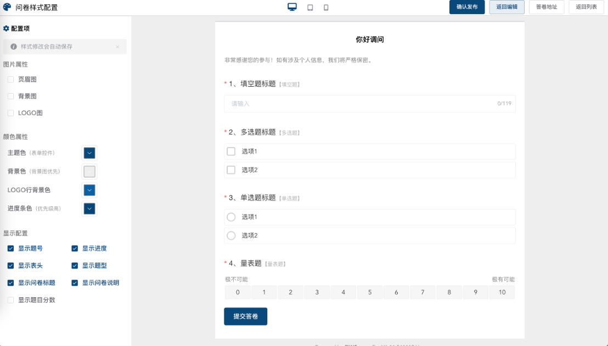

# 调问开源问卷系统（DWSurvey）

    十二年开源沉淀，帮你建设属于自己的问卷表单系统

[](https://gitee.com/wkeyuan/DWSurvey/stargazers)
[](https://gitee.com/wkeyuan/DWSurvey/members)


## 关于调问

🎉🎉调问（DWSurvey）问卷表单自2012年项目启动至今，已经过12年沉淀积累，先后进行了6次大框架升级，前端完成了从JSP、JQuery到Vue框架的改造。服务了数千家包括企业、政府部门、高职院校在内的真实客户。
这些客户，使我们知道了问卷表单中很多被忽略的细节和实际场景中会用到的需求。这些反馈就像养分不断滋养着调问问卷表单的成长。

🎉🎉在调问（DWSurvey）问卷表单的第13个年头，我们完成了VUE3版本的升级，推出了全新框架和基于vue的开源版本。在开源问卷表单的路上，我们依然在认真、努力地前行。
如果您有任何的需求和建议，随时联系调问的产品团队，也可以直接在社区留言，我们会认真对待每一个用户的声音。每一次更新迭代改动，都会记录在此 <a href="https://www.diaowen.net/upload-log">更新日志</a>

用心做好每一个功能，我们很需要你的鼓励！右上角Star🌟，等你点亮！


<p>任何问题都可以加产品微信</p>


<p>调问问卷公众号</p>

## 技术架构
    
前后端完全分离，前端分别提供Vue2，Vue3 框架实现，后端开发语言主要基于JAVA，通过 HTTP API进行服务调用整合以实现业务功能，数据库采用 MySQL、Elasticsearch 存储， 缓存采用Redis，保证业务的高性能、可靠性和可扩展性。
    
本产品应用服务支持 Docker 镜像一键部署，需要预先在服务器上准备好 Docker 环境，目前社区版已经提供好一键安装Docker 镜像可以免费下载，整体实施起来比较简单。
关于后续更新，在完成部署之后，可通过更新容器镜像进行升级。

*Docker具体操作请参考*
<a href="https://www.diaowen.net/install/docker">https://www.diaowen.net/install/docker</a>

## 系统演示及截图

<p>调问网官网地址：<a href="https://www.diaowen.net">https://www.diaowen.net</a></p>

<p><strong>社区免费版一键安装包</strong></p>
<p><strong>下载地址：<a href="https://www.diaowen.net/install/docker">https://www.diaowen.net/install/docker</a></strong></p>

<p><strong>企业版V8新Vue3版体验地址</strong></p>
<p><strong>V8新版本：<a href="https://demo.diaowen.net">https://demo.diaowen.net</a></strong></p>





## 系统亮点&核心功能

最新开源版本为V7版本，此开源版本具备成熟的基础能力，足以满足一般场景下的问卷需求，前后端分别采用Vue2、Element UI、Spring Boot框架。
如果您有更高级的功能需求，您也可以体验最新商用V8版本，前后端分别采用Vue3、Element Plus、Spring Boot框架。体验地址
几个版本的功能差异，详见这里
任何需求及Bug请戳反馈社区，我们将第一时间排期完善。
同时历史老版本分别采Jsp+Struts2、Jsp+SpringBoot、Vue2+JQuery+SpringBoot, 详情点击（后期只修Bug，不再进行功能迭代），各历史版本仓库链接地址放在文末。


我们力求打造出可以稳定可商用、满足各种问卷场景的开源问卷表单系统。相较而言，调问问卷表单具有如下两点：
* 部署简单，一行命令完成部署
* 更新方便，直接替换原安装文件不用担心数据被覆盖
* 完善的浏览器兼容、保证传统客户也能正常使用
* 多种端适配，不管是PC还是移动端同一个地址系统自动适配
* 最高支持多达40多种题型，如单选题、多选题、填空题、评分题、排序题、分页、分段...
* 可见即所得设计理念、所有内容支持快速富文本编辑
* 调问问卷DSL自定义逻辑可以快速地操作问卷底层能力，实现复杂的逻辑定制，提高问卷逻辑设置的效率。目前已经实现了多条件组合的显示逻辑、非逻辑、题目内容引用替换、题目选项分组随机、计算逻辑等功能，更多功能正在陆续开发中。
* 支持答卷密码、结束跳转、仅微信答卷限制等
* 数据实时统计，答卷的数据以可视化的方案展现，不同的统计图表
* 后端满足JPA规范，为未来支持更多数据库提供条件
* 成熟稳定，经过多年技术发展，技术体系完善
* 完善的支持服务，QQ群，微信群全天24小时技术服务

<strong> 🎉🎉🎉  目前已支持功能包括</strong> 

* 支持题型：

单选题，多选题，填空题，评分题，排序题，多行填空题，多项填空题，日期题，时间题，下拉单选题，文件上传题，分页，分段，量表题，滑块题，级联题，矩阵单选题，矩阵多选题，矩阵评分题，矩阵填空题，矩陈量表题，矩陈滑块题，签名题，定位题，双重定位 ，模糊定位，精确定位，矩阵数值题，矩阵组合题，矩阵下拉题，矩阵自增题，甄别题，甄别数据记录，图片单选题，图片多选题，绘图题，地图组件，分割线，图片轮播，图片上传，水印设置
* 题型扩展能力

题目高级编辑，时间题高级设置，量表题，滑块题，多项填空高级设置，表单14种格式验证，填空题高级设置，多选题选项，单选题高级设置，多选题高级设置，下拉题高级设置，排序题高级设置，填空题数据验证长度
* 支持题库

专业选择题，院校选择题，行业选择题，职业选择题，行政区选择题，常用题库（姓名、性别、学历等）
* 逻辑控制

显示逻辑，跳转逻辑，隐藏逻辑，DSL逻辑_显示语句，DSL逻辑_隐藏语句，DSL逻辑_跳转语句，DSL逻辑_条件语句，DSL逻辑_多条件组合，DSL逻辑_互斥语句，DSL逻辑_验证语句，DSL逻辑_赋值语句，DSL逻辑_计算语句

* 样式管理

页眉图设置，背景图设置，Logo图设置，主题色设置，预置主题，背景色设置，Logo行背景色，进度条色设置，显示题号设置，显示进度设置，显示表头设置，显示题型设置，显示标题设置，显示问卷说明设置，显示题目分数设置，矩陈题移动端适配，PC与移动端自适应

## 运行环境

社区版环境版本：jdk1.8, tomcat8.5.59
数据库：Mysql5.7+，
建议最低运行配置：Linux cpu & 2核4G

## 安装&使用文档

### 快速安装（一行命令完成）

<strong>推荐通过Docker一键安装包完成</strong>
<a href="https://www.diaowen.net/install/docker">https://www.diaowen.net/install/docker</a>

更详细安装说明请查看[说明文档](http://www.diaowen.net/docs/)

## 本地开发

开发工具：vscode, idea
node版本：v18.16+

### 基本步骤

1、下载代码后

具体代码地址参考[多种技术方案](#多种技术方案)

2、创建数据库进行初始化

数据库脚本在resources/sql/目录下的dwsurvey.sql数据库脚本文件，如下：

    https://gitee.com/wkeyuan/DWSurvey/blob/master/src/main/resources/conf/sql/

说明：升级后的数据库与老版本兼容

3、用IDEA打开，进行本地开发

现在您可以进行本地开发了

4、开发完成，编译打包

进入 `cd DWSurvey`:

```bash
mvn package
```

配置文件地址

    源码配置文件地址
    resources/application-***.yml

    war包配置文件地址
    /dwsurvey-oss-v.4.0/WEB-INF/classes/application-dev.yml

	#database settings
	datasource:
    url: jdbc:mysql://localhost:3306/dwsurvey_21test?useUnicode=true&characterEncoding=utf8
    username: root
    password: 123456,.

    分别修改```url、username、password```

5、启动浏览器访问

输入 http://localhost:8080

初始账号：```service@diaowen.net``` 密码：```123456```

## 关注我们&互动

对于调问问卷系统的任何问题，都可以加客服微信进行咨询，也可以关注我们的公众号，我们每周都将会将会在公众号同步更迭代信息。


任何问题都可以加产品微信


调问问卷公众号

调问现在有4个供大家交流的QQ群：用户群1：635994795（已满）、用户群2：301105635（已满）、用户群3：811287103（已满）、用户群4：398556555，
如果遇到加群被拒绝的情况，说明交流群已满，请先加客服微信，我们将根据您的情况，拉到对应的QQ群中。

### 各技术版本简介

<table>
<tr><th><strong>方案A</strong></th><th colspan="2" align="left"><strong>前后端分离，基于 Vue、Element ui、Spring Boot</strong></th></tr>
<tr><td colspan="3">方案特性：基于VUE、前后分离开发更容易，部署维护更简单</td></tr>
<tr><td rowspan="2">前端</td><td>Gitee</td><td><a href="https://gitee.com/wkeyuan/dwsurvey-vue">https://gitee.com/wkeyuan/dwsurvey-vue</a></td></tr>
<tr><td>GitHub</td><td><a href="https://github.com/wkeyuan/DWSurvey_Vue">https://github.com/wkeyuan/DWSurvey_Vue</a></td></tr>
<tr><td rowspan="2">后端</td><td>Gitee</td><td><a href="https://gitee.com/wkeyuan/DWSurvey">https://gitee.com/wkeyuan/DWSurvey</a></td></tr>
<tr><td>GitHub</td><td><a href="https://github.com/wkeyuan/DWSurvey">https://github.com/wkeyuan/DWSurvey</a></td></tr>

<tr><th><strong>方案B</strong></th><th colspan="2" align="left"><strong>Spring Boot + JSP</strong></th></tr>
<tr><td colspan="3">方案特性: 原生JS+HTML技术，支持更多浏览器，如IE6</td></tr>
<tr><td colspan="1">Gitee</td><td colspan="2"><a href="https://gitee.com/wkeyuan/dwsurvey-springboot-jsp">https://gitee.com/wkeyuan/dwsurvey-springboot-jsp</a></td></tr>
<tr><td colspan="1">GitHub</td><td colspan="2"><a href="https://gitee.com/wkeyuan/dwsurvey-springboot-jsp">https://gitee.com/wkeyuan/dwsurvey-springboot-jsp</a></td></tr>

<tr><th><strong>方案C</strong></th><th colspan="2" align="left"><strong>Struts2 + JSP</strong></th></tr>
<tr><td colspan="3">方案特性: 原生JS+HTML技术，支持更多浏览器，如IE6 |</td></tr>
<tr><td colspan="1">Gitee</td><td colspan="2"><a href="https://gitee.com/wkeyuan/dwsurvey-struts2-jsp">https://gitee.com/wkeyuan/dwsurvey-struts2-jsp</a></td></tr>
<tr><td colspan="1">GitHub</td><td colspan="2"><a href="https://gitee.com/wkeyuan/dwsurvey-struts2-jsp">https://gitee.com/wkeyuan/dwsurvey-struts2-jsp</a></td></tr>
</table>

## 社区版源代码地址

gitee: http://gitee.com/wkeyuan/DWSurvey

github: https://github.com/wkeyuan/DWSurvey

## 版权说明

DWSurvey以通用公共许可证AGPL3.0为开源协议，部署使用要求保留"Power by diaowen.net"标识，且衍生版本需要及时开源。
需要更优质的服务可以购买我们的专业版与企业版！更多信息，请查看调问官网

