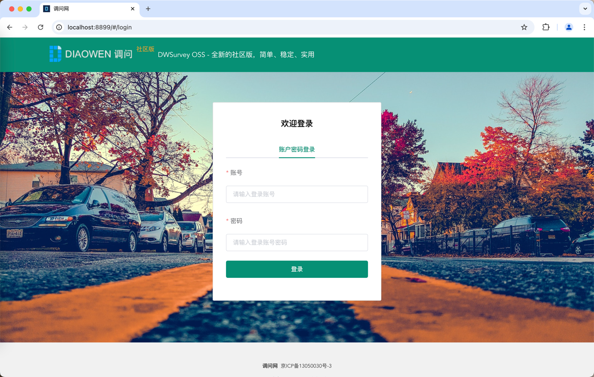
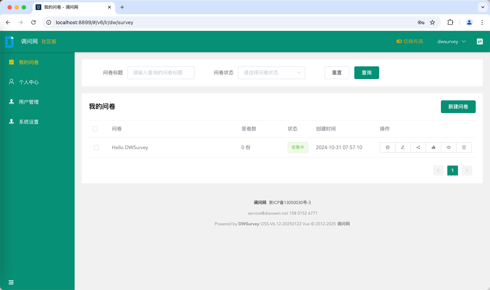
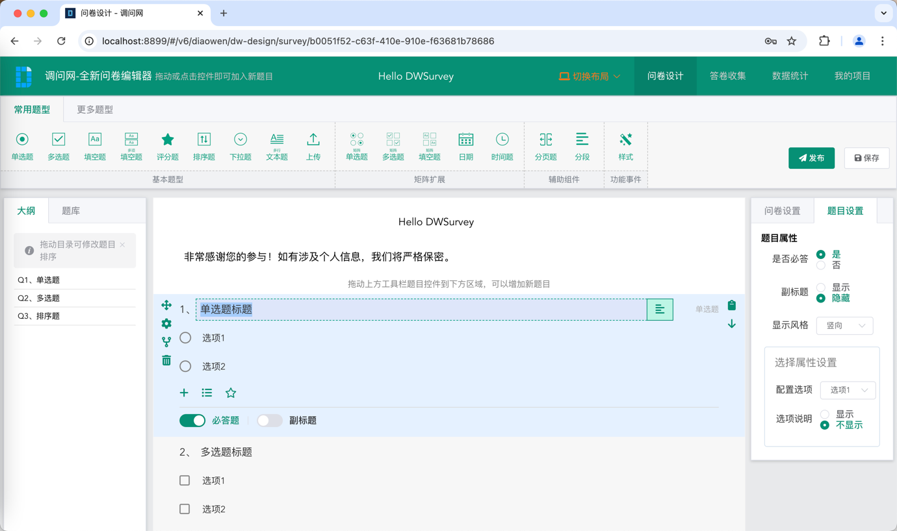
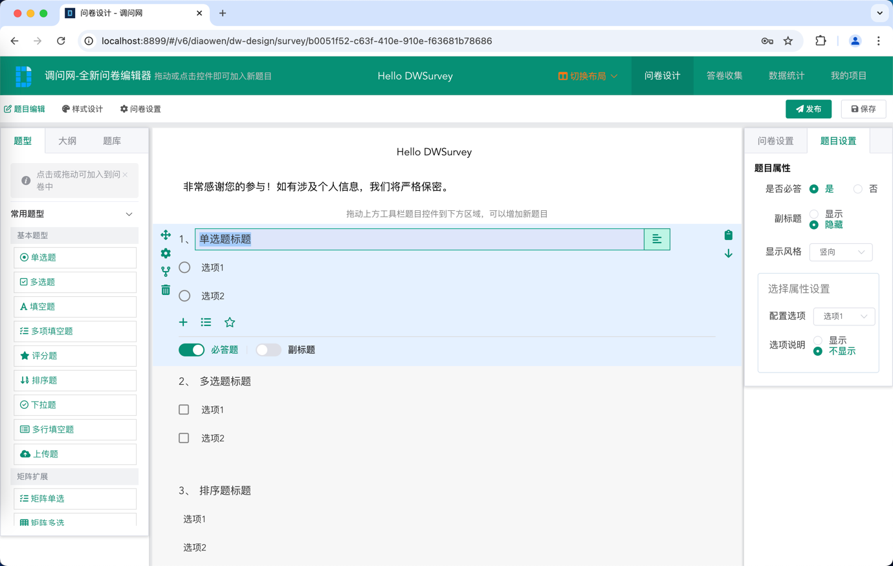
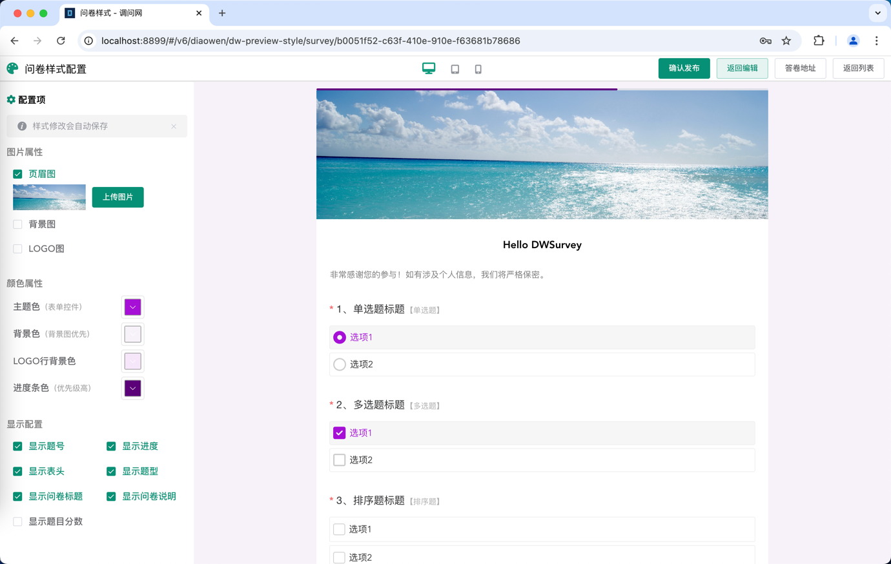
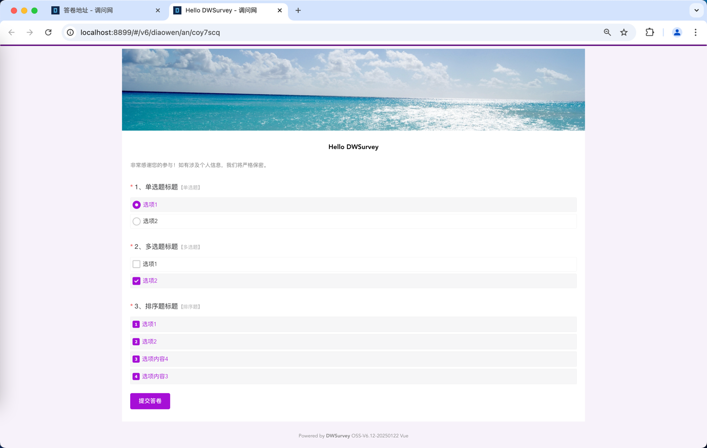

# DWSurvey Open source questionnaire form system

    Twelve years of open-source accumulation, helping you build your own questionnaire form system

<p>
<a href='https://gitee.com/wkeyuan/DWSurvey'>
    </img>
</a>
<a href='https://gitee.com/wkeyuan/DWSurvey'>
    </img>
</a>
<a href='https://github.com/wkeyuan/DWSurvey'>
    </img>
</a>
<a href='https://github.com/wkeyuan/DWSurvey'>
    </img>
</a>
</p>
<p>
<a href="https://www.diaowen.net/" target="_blank">Website</a>&nbsp;
<a href="https://www.diaowen.net/" target="_blank">Experience</a>&nbsp;
<a href="https://www.diaowen.net/install/docker" target="_blank" >Deployment</a>&nbsp;
<a href="https://gitee.com/wkeyuan/DWSurvey/issues" target="_blank">Community</a>&nbsp;
</p>

**<p>🫣 If you find the project helpful, please click on the Star button in the upper right corner 🌟  Encourage us and support the inquiry of open source teams</p>**

---

[简体中文](./README.md) |  English

## About dwsurvey

DWSurvey questionnaire form 🎉🎉 Since the project was launched in 2012, it has accumulated 12 years of accumulation, and has undergone 6 major framework upgrades. The front-end has completed the transformation from JSP, jQuery to Vue framework. We have served thousands of real clients, including enterprises, government departments, and vocational colleges.

These customers have made us aware of many overlooked details in the questionnaire form and the requirements that will be used in practical scenarios. These feedbacks are like nutrients constantly nourishing the growth of the survey form.

In the 13th year of the DWSurvey questionnaire form 🎉🎉， We have completed the upgrade of VUE3 version and launched a new framework and an open-source version based on Vue. On the path of open source questionnaire forms, we are still moving forward seriously and striving.

If you have any needs or suggestions, please feel free to contact the product team for inquiries, or leave a message directly in the community. We will take every user's voice seriously.

We need your encouragement to do every function with care! Star in the upper right corner 🌟 Follow and wait for you to light up!

## Technical Architecture

The front-end and back-end are completely separated, with Vue2 and Vue3 frameworks provided for implementation. The back-end development language is mainly based on JAVA, integrating service calls through HTTP APIs to achieve business functions. The database is stored in MySQL and Elasticsearch, and the cache is stored in Redis to ensure high performance, reliability, and scalability of the business.

This product's application service supports one click deployment of Docker images, and requires a Docker environment to be prepared on the server in advance. Currently, the community version provides one click installation of Docker images that can be downloaded for free, making the overall implementation relatively simple.

Regarding subsequent updates, upgrading can be done by updating the container image after deployment is completed.

## Product Introduction

<p>
DWSurvey Official website address：
<strong>
<a href="https://www.diaowen.net" target="_blank">https://www.diaowen.net</a>
</strong>
</p>

### Community 

Since its inception, Zhaowen has consistently adhered to 100% open source for all front-end and back-end code 💯， Ensure the stability and adaptability of all functions 👏。

<p><strong>Installation and download address (installation package)：<a href="https://www.diaowen.net/install/docker" target="_blank">https://www.diaowen.net/install/docker</a></strong></p>

<p>
<strong>
Source code download address (including front-end and back-end)：<a href="https://gitee.com/wkeyuan/DWSurvey" target="_blank">https://gitee.com/wkeyuan/DWSurvey</a>
</strong>
</p>

### Enterprise 

<p>The Enterprise Edition currently offers two versions of services: Vue3 and Vue2</p>
<p><strong>V8 new version：<a href="https://demo.diaowen.net" target="_blank">https://demo.diaowen.net</a></strong></p>

## System Highlights&Core Functions

The latest open source version is V7, which has mature basic capabilities and is sufficient to meet the questionnaire needs in general scenarios. The front-end and back-end adopt Vue2, Element UI, and Spring Boot frameworks respectively.

If you have more advanced functional requirements, you can also experience the latest commercial V8 version, which uses Vue3, Element Plus, and Spring Boot frameworks for the front-end and back-end respectively.

Experience the functional differences of several versions, see here for details

Please provide feedback on any requirements or bugs in the community or contact product customer service, and we will arrange for improvement as soon as possible.

At the same time, the historical old versions adopt Jsp+Struts2 Jsp+SpringBoot、Vue2+JQuery+SpringBoot,  Click on the details (only fix bugs later, no further feature iterations), and place the link addresses of each historical version repository at the end of the article.

We strive to create an open-source questionnaire form system that is stable, commercially viable, and suitable for various questionnaire scenarios.

In comparison, the questionnaire form has the following two points: 🎉🎉🎉

* Originality 🎉🥇 Introduce drag and drop creation of questionnaires
* Visible WYSIWYG design concept, all content supports fast rich text editing
* Easy deployment, complete deployment with one command
* Easy to update, simply replace the original installation file without worrying about data being overwritten
* Multiple end adaptation, whether it's PC or mobile, the same address system automatically adapts
* Support **50+custom components**, drag and drop to quickly generate questionnaire forms.
* Each WeChat account, account ip、 Equipment, limited number of answer times, support for setting allowed time for filling in, and recording WeChat personal information * *.
* Up to 40 types of questions can be supported, such as Single choice question, multiple choice, blank filling, scoring, sorting, paging, segmentation
* Support answer password, end jump, WeChat only answer restriction, etc
* Real time data statistics, presentation of answer sheet data in a visual format, with different statistical charts and graphs
* The backend meets the JPA specification, providing conditions for supporting more databases in the future
* **First of all 🎉🥇 Introduce a questionnaire programming language unique to the survey, and configure the questionnaire logic like programming**
* The custom logic of DSL can quickly operate the underlying capabilities of questionnaires, achieve complex logic customization, and improve the efficiency of questionnaire logic settings. At present, multiple conditional combinations of display logic, non logic, replacement of title content references, random grouping of title options, calculation logic, and other functions have been implemented, and more functions are being developed gradually.
* Mature and stable, with years of technological development and a complete technical system
* Complete support services, QQ groups, WeChat groups 24/7 technical services

<strong>  🎉🎉 Currently supported features include  </strong> 

* Support question types

> Single choice question, multiple choice question, blank filling question, scoring question, sorting question, multi line blank filling question, multiple blank filling questions, date question, time question, drop-down Single choice question, file upload question, pagination, segmentation, scale question, slider question, cascade question, matrix Single choice question, matrix multiple choice question, matrix evaluation sub question, matrix blank filling question, moment scale question, moment scale slider question, signature question, positioning question, double positioning, fuzzy positioning, precise positioning, matrix numerical question, matrix combination question, matrix drop-down question, matrix self increasing question, screening question, screening data record, picture Single choice question, picture multiple choice question, drawing Title, map component, split line, image carousel, image upload, watermark setting

* Ability to expand question types

> 🎉 Advanced editing of questions, advanced setting of time questions, scale questions, slider questions, advanced setting of multiple blank filling, form 14 format verification, advanced setting of blank filling questions, multiple choice questions, advanced setting of Single choice question, advanced setting of multiple choice questions, advanced setting of drop-down questions, advanced setting of sorting questions, data verification length of blank filling questions

* Support question bank

> Major Multiple Choice Questions, College Multiple Choice Questions, Industry Multiple Choice Questions, Career Multiple Choice Questions, Administrative Region Multiple Choice Questions, Common Question Bank (Name, Gender, Education, etc.)

*  **Logic Controller**

> 🎉✨ Display Logic, Jump Logic, Hidden Logic, DSL Logic_Display Statement, DSL Logic_Hidden Statement, DSL Logic_Jump Statement, DSL Logic_Conditional Statement, DSL Logic_Multi condition Combination, DSL Logic_Exclusive Statement, DSL Logic_Validation Statement, DSL Logic_Assignment Statement, DSL Logic_Calculation Statement

* style manage

> 🎉 Header image setting, background image setting, Logo image setting, theme color setting, preset theme, background color setting, Logo row background color, progress bar color setting, display question number setting, display progress setting, display header setting, display question type setting, display title setting, display questionnaire description setting, display question score setting, matrix question mobile adaptation, PC and mobile adaptation

## Operating environment

Community version environment version: jdk1.8, tomcat8.5.59

database Mysql5.7+，

Suggested minimum running configuration: Linux CPU&2 cores 4G

## Installation&Usage Documentation

### Quick installation (completed in at least 3 minutes)

<strong>Recommend using Docker to install packages with just one click</strong>

<a href="https://www.diaowen.net/install/docker"> One click installation </a>

For more detailed installation instructions, please refer to the [instruction document](http://www.diaowen.net/docs/)

## Local development

Development tools: vscode, idea
Node version: v18.16+

### Basic steps

1. After downloading the code

Specific code address reference [Multiple Technical Solutions] (# Multiple Technical Solutions)

2. Create a database for initialization

The database script in the resources/sql/directory is the dwsurvey. SQL database script file, as follows:

    https://gitee.com/wkeyuan/DWSurvey/blob/master/src/main/resources/conf/sql/

Explanation: The upgraded database is compatible with the old version

3. Open with IDEA for local development

Now you can proceed with local development

4. Development completed, compiled and packaged

Enter `cd DWSurvey`:

```bash
mvn package
```

Configuration file address

    Source code configuration file address
    resources/application-***.yml

    War package configuration file address
    /dwsurvey-oss-v.4.0/WEB-INF/classes/application-dev.yml

	#database settings
	datasource:
    url: jdbc:mysql://localhost:3306/dwsurvey_21test?useUnicode=true&characterEncoding=utf8
    username: root
    password: 123456,.

    Modify separately```url、username、password```

5. Launch browser access

Input http://localhost:8080

Initial account:```service@diaowen.net```Password: ```123456```

## Join the community

For any question about the questionnaire system, you can add customer service WeChat for consultation, or follow our official account, and we will synchronize and update information on our official account every week.

<p>

</p>

<p>

</p>

There are currently 4 QQ groups available for everyone to communicate: User Group 1: 635994795 (full), User Group 2:301105635 (full), User Group 3:811287103 (full), User Group 4:39855655,

If you encounter a situation where adding to a group is rejected, it means that the communication group is full. Please add your customer service WeChat first, and we will pull you to the corresponding QQ group according to your situation.

## Community Edition

### Vue Implementation Preview








### JQuery Implementation Preview


## Community version source code address

gitee: http://gitee.com/wkeyuan/DWSurvey

github: https://github.com/wkeyuan/DWSurvey

## Copyright Notice

DWSurvey is licensed under the General Public License AGPL3.0 as an open source protocol, and deployment requires the retention of the "Power by diaowen. net" logo, and derivative versions need to be open sourced in a timely manner.
If you need better service, you can purchase our Professional and Enterprise editions! For more information, please refer to the official website of Zhaowen

